# 🤖 Fake Voice Detection with FastAI & Streamlit

This project develops and deploys a fake voice detection application using deep learning with FastAI and an interactive interface built with Streamlit.

---

## Overview

This application provides an intuitive and interactive platform for training and evaluating deep learning models, with an initial focus on detecting audio synthesized by neural Vocoders. Our goal is to lower the barrier to entry for AI experimentation, simplifying the complex process of hyperparameter tuning and model training. It also serves as a practical tool for research validation and replication, fostering scientific reproducibility.

## ✨ Features

- **Simplified Training Interface:** Visually configure and manage deep learning model training without extensive coding.
- **Transfer Learning Model Support**: Supports training with various pre-trained transfer learning models (e.g., VGG16, ResNet).
- **Hyperparameter Tuning Control:** Easily adjust key parameters like epochs, batch size, and learning rates via an intuitive UI.
- **Real-time Training Monitoring:** Observe training progress, loss, and accuracy metrics in real-time, including a progress bar.
- **Neural Vocoder Detection:** Specialized pipeline for classifying original (bonafide) vs. synthesized audio using Mel spectrograms and Convolutional Neural Networks (CNNs).
- **Model and Result Management:** View and download training history (graphs and CSV), trained models (`.pkl`), and confusion matrices.
- **WAV File Testing:** Upload `.wav` audio files for instant prediction and class probability visualization.
- **Dockerized Application**: The entire application is containerized using Docker, ensuring consistent environments across different machines and simplifying deployment by eliminating dependency conflicts.
---

## 🚀 Requirements

- **Docker**: `latest stable`.
- **NVIDIA Toolkit**: For GPU support. Example: `sudo apt install nvidia-container-toolkit`.
- **NVIDIA Docker Runtime**: Configure Docker to use the NVIDIA runtime. Example: `sudo nvidia-ctk runtime configure --runtime=docker` followed by `sudo systemctl restart docker`.
- **Python**: Version 3.10 or higher (optional for local testing).

---

## 📁 Directory Structure

```bash
├── app.py                     → Streamlit application
├── Dockerfile                 → Application container definition
├── docker-compose.yml         → Volumes definition
├── requirements.txt           → Project dependencies
├── README.md                  → This README file
└── ...
```

---

## ⚙️ Usage (Linux)

### 1. Clone the Repository (with Submodule)

```bash
git clone --recurse-submodules https://github.com/LaKHamote/streamlitAppForVoiceFakeDetection.git
cd streamlitAppForVoiceFakeDetection
```

### 1.1 Update submodule (opcional)

`git submodule update --remote --merge`

### 2. Prepare Dataset ([Vocoderrecognition](https://github.com/fbvidal/VoCoderRecognition/tree/submodule-for-streamlit-app) Submodule)
You can personalize the speakers, vocoders, and noise levels by directly editing the components/VoCoderRecognition/scripts/env.sh file before running the setup.sh script.

To prepare the dataset, execute the following commands:

```bash
pip install -r requirements_min.txt
source components/VoCoderRecognition/setup.sh
```

This script will perform the following actions:

- Download speakers (defined by `SPEAKERS`) from `components/VoCoderRecognition/scripts/env.sh`.
- Download vocoders (defined by `VOCODER_TAGS`) from `components/VoCoderRecognition/scripts/env.sh`.
- Resample audio frequencies to 22050Hz (required by vocoders).
- Generate new audio for each vocoder.
- Generate Mel Spectrograms for each noise level (defined by `NOISE_LEVEL_LIST`) in `components/VoCoderRecognition/scripts/env.sh`.

OBS: If you don't have access to the submodule, there's a `.zip` file in the `components/` directory containing only the essential parts and an example dataset.

#### 2.1 Custom Dataset (optional)

If you wish to use a custom dataset, please follow this organizational structure:

```bash
your_dataset/
├── noise1/
│   ├── speaker1/
│   │   ├── class1/
│   │   │   │── image.png
│   │   │   └── ...
│   │   │── class2/
│   │   └── ...
│   │── speaker2/
│   └── ...
│── noise2/
└── ...
```

Then, ensure you:

1. Modify the dataset directory path to be mounted in your `docker-compose.yml` (e.g., update `your_dataset` on line 11 in the example below).
2. Adjust variables in `components/VoCoderRecognition/scripts/env.sh` to match your dataset's specifics (e.g., speaker names, vocoder tags, noise levels).

### 3. Build with Docker Compose

Create a Docker volume to reuse downloaded weights:

Example `docker-compose.yml`:

```yaml
services:
  app:
    build: .
    ports:
      - your_open_port:8501 # Replace 'your_open_port' with your desired port
    volumes:
      - .:/app
      - ./your_dataset:/dataset # You can change the dataset folder mount path to your desired location with the dataset in the correct format
      - ~/.cache/torch/hub:/root/.cache/torch/hub # This prevents re-downloading weights after training
    environment:
      - STREAMLIT_SERVER_PORT=8501
    runtime: nvidia # Enable GPU support`
```

### 4. Start the Application

Execute the following command in your terminal:

Bash

`docker compose up --build`

---

## 🧠 Available Models

You can select from the following deep learning architectures for model training:

- VGG16
- VGG19
- ResNet18
- ResNet34
- ResNet50
- AlexNet

---

## 💾 Training Download Options

After training, the following options will be available:

- View and download the loss history (as a graph and CSV).
- Download the trained model in `.pkl` format.
- Download the confusion matrix.

---

## 🧪 Audio Testing

Once a model is trained or loaded:

1. (Optional) Upload your own model.
2. Upload a `.wav` audio file.
3. View the prediction result (e.g., "Fake" or "Original").
4. Examine the probabilities for each class to understand model confidence.

---

## How to Use the App 🧑‍💻

The Streamlit application is organized into different pages, providing a comprehensive experience for training, monitoring, and analyzing synthesized audio detection models. Below, we describe the main pages and their purposes, illustrated by screenshots.

---

### Home Page

This section groups the interfaces related to the user's initial interaction with the application and its main navigation.

- **Public Home Page (Login):**
This page presents an overview of the application, its purpose, and basic instructions for users who have not yet logged in. It aims to attract and inform new users about the system's capabilities, as shown in Figure 1.

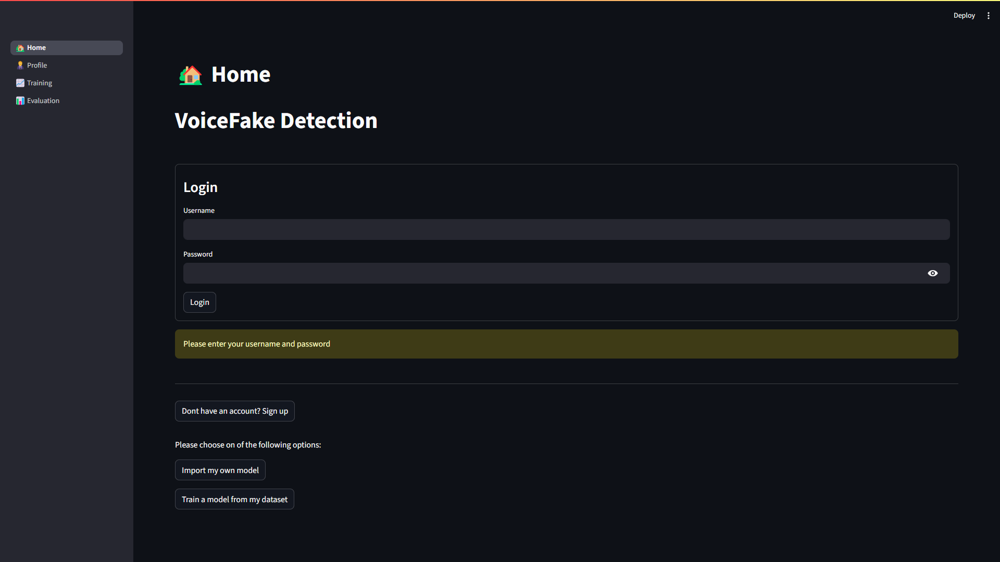

- **Logged-in Home Page:**
Displayed after successful user authentication, this page serves as a central dashboard for accessing the application's main functionalities. It includes links to the training and analysis sections, as shown in Figure 2.

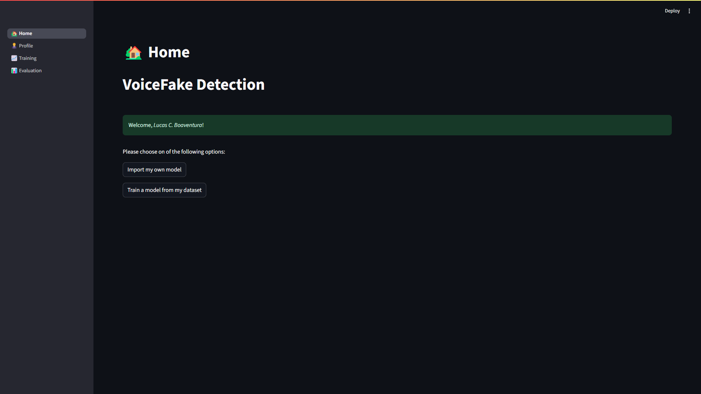

- **User Registration Screen:**
Allows new individuals to create an account in the application, providing the necessary credentials to access restricted functionalities, as shown in Figure 3.

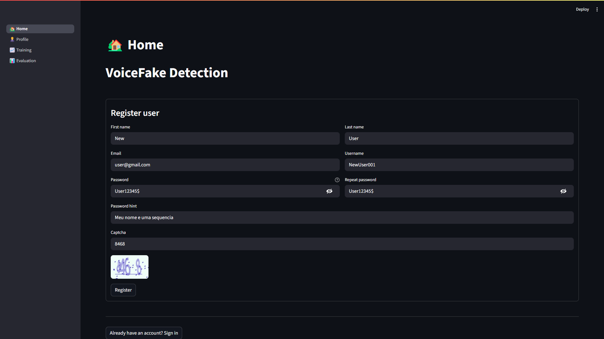

---

### Profile Page

Dedicated to managing and viewing user information on the platform.

- **Public User Profile View:**
On this page, all users who are not logged in share their models publicly, as shown in Figure 4.

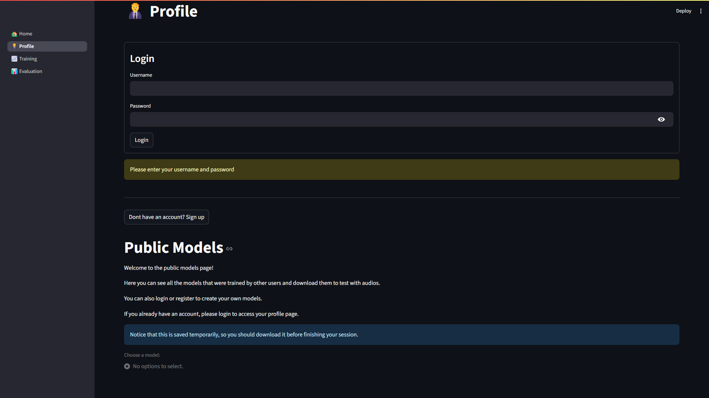

- **Logged-in User Profile Page:**
Dedicated to the authenticated user, this page allows viewing and editing personal data and the history of their activities on the platform, including the ability to download personal results obtained for each training session, as shown in Figure 5.

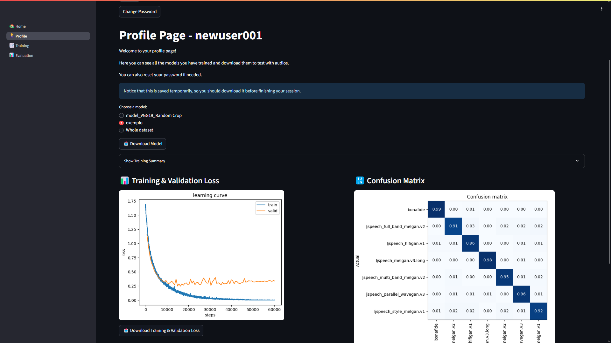

- **Password Reset Screen:**
Offers a mechanism for users to reset their account access in case they forget their password, as shown in Figure 6.

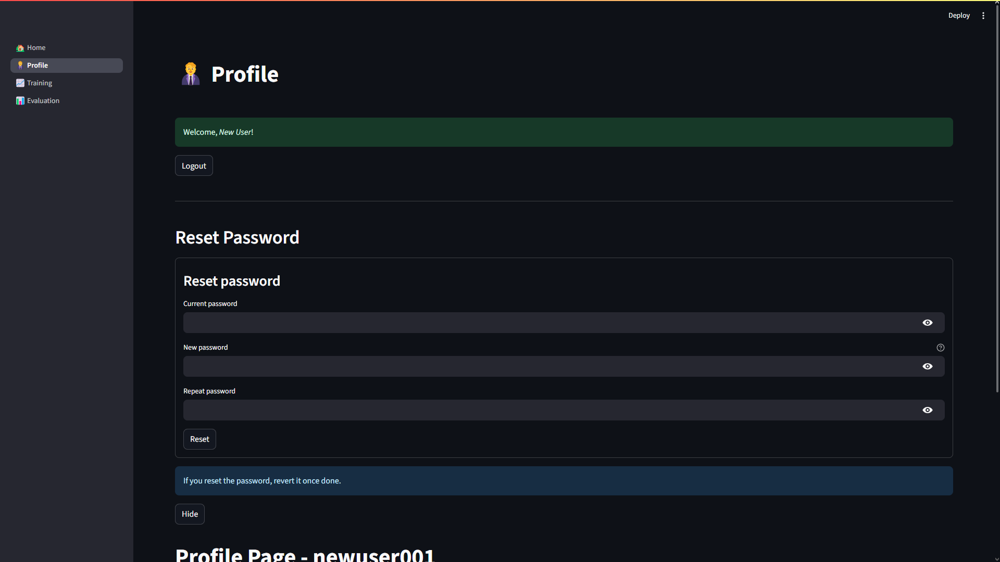

---

### Training Page

This section covers the main functionalities for the model training lifecycle.

- **Model Training Interface:**
This page centralizes the tools for initiating and managing the deep learning model training process. It includes options for architecture selection, hyperparameter configuration (with small tips on the importance of each value), data selection, and real-time progress monitoring, as shown in Figure 7.

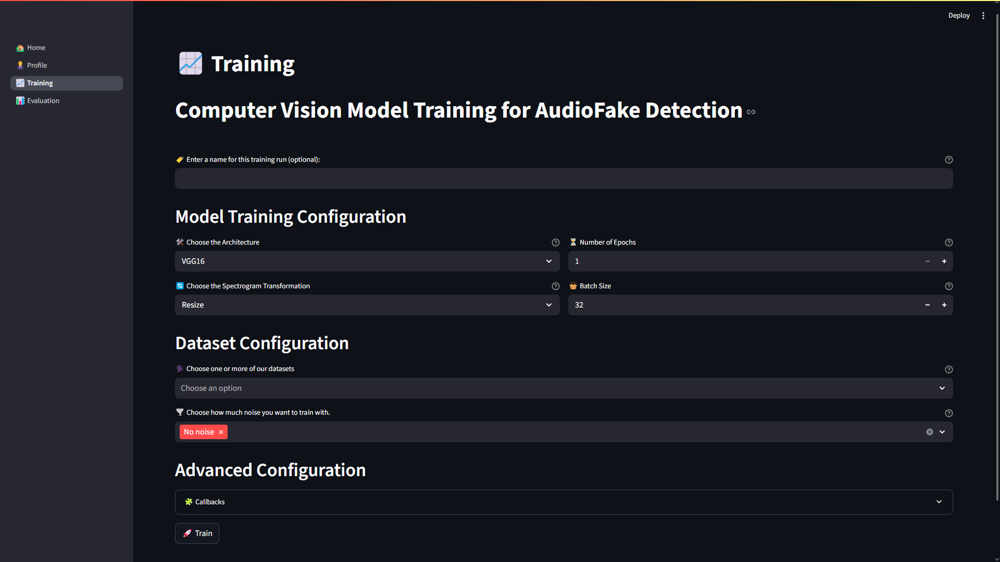

- **Advanced Configuration Screen:**
Offers experienced users the ability to adjust specific model and training process parameters not exposed in the basic interface, which is aimed at beginners. This includes any Fastai `Callback` function, requiring **Python** code input, as shown in Figure 8.

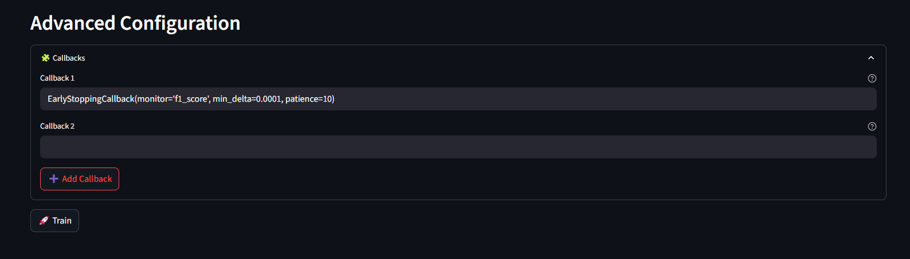

#### Usage Example

To illustrate the training process, let's consider an example where the following configurations were set (as seen in Figure 9):

- **Model:** VGG19
- **Data Augmentation:** Random Crop
- **Epochs:** 100
- **Batch Size:** 32
- **Dataset Selection:** Two male American speakers with a large amount of noise.

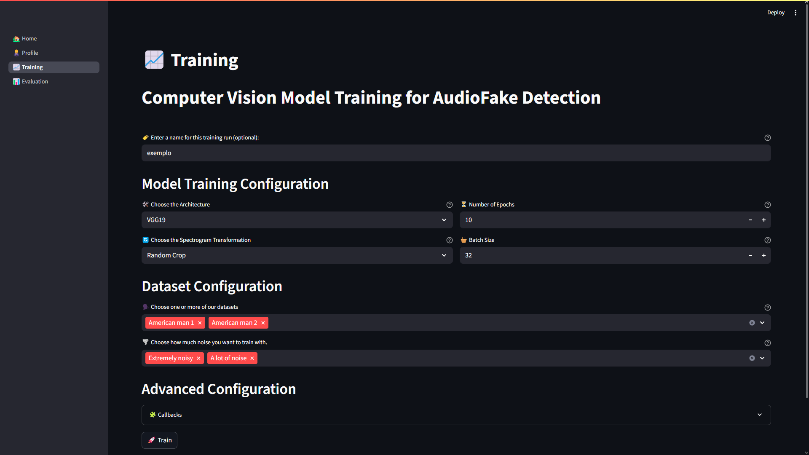

Once training is initiated:

- A **notification** is first displayed, showing the number of spectrograms available for training, categorized by speaker and added noise (as shown in Figure 10).

  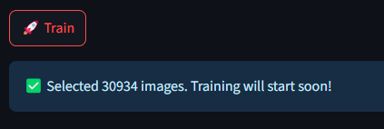

- During model training, the interface displays **real-time performance metrics**. This allows users to:
    - Monitor model convergence through a dynamic **graph** (as shown in Figure 11).

    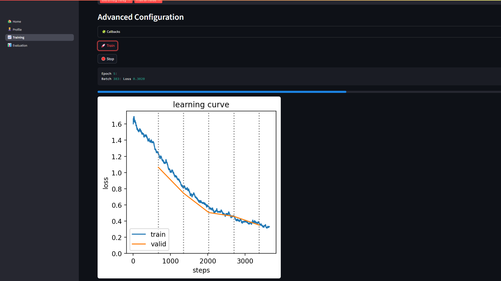

    - **Stop the training** at any point.
    - Observe a **progress bar** indicating loading status and overall training progress.
- Upon **completion of training**, the application notifies the user. Subsequently, detailed final results are displayed, including:
    - The complete **performance graph**.
    - A **confusion matrix** for visualizing classification errors and successes (as shown in Figure 12).

    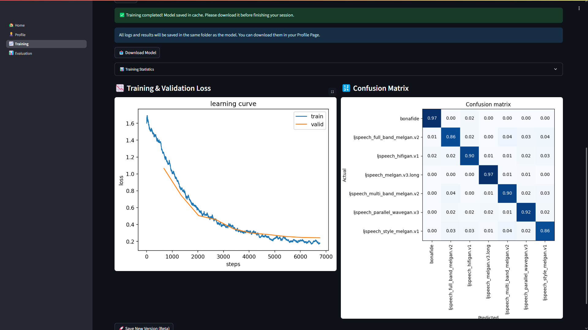

    - A **table** detailing training metrics for each epoch (as shown in Figure 13).

    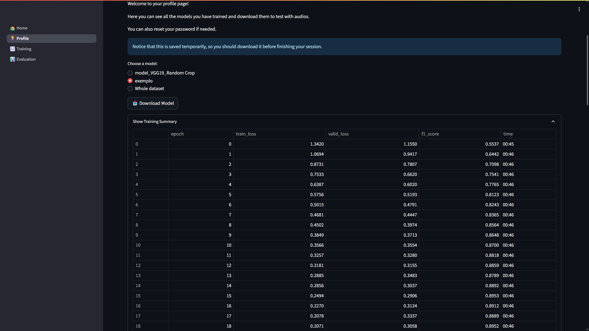


After the training is complete and results are presented:

- Users have the option to **download the trained model** for external use.
- Alternatively, they can proceed directly to the **Evaluation page** to manually test the model with new data.
- **Important Note:** All training results (including metric history and the trained model) are automatically saved and remain available for viewing and downloading later from the user's Profile Page (as shown in Figure 5).
    

---

### Evaluation Page

This section allows the user to evaluate their model with audio files.

- **Select Model**
Upon accessing the evaluation page, the user has the flexibility to choose which model to test. Options include using the last model trained in the current session or loading a previously downloaded '.pkl' model file, as shown in Figure 14.

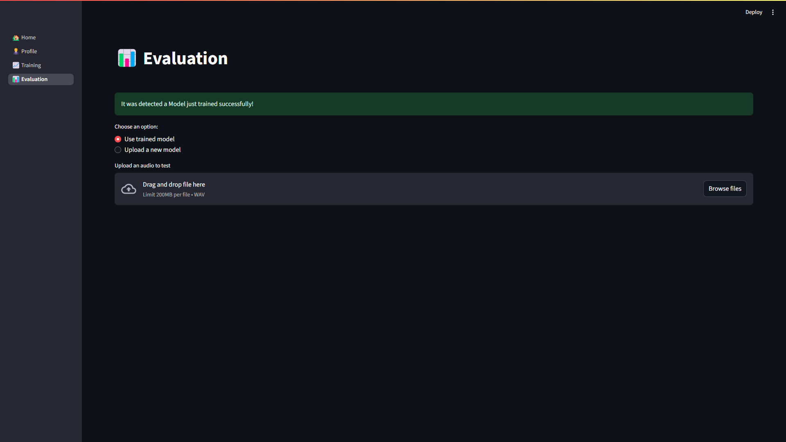
    
- **Audio Upload**
Once the model is selected, the user can upload an audio file for analysis. It is crucial that the audio meets the model's expected characteristics: '.wav' format and a sample rate of 22050Hz. The audio upload option is also visible in Figure 14.
    
    The application is responsible for all necessary pre-processing, including the generation of the Mel Spectrogram from the provided audio, which will serve as input for the model. Thus, after processing, the user is shown the option to listen to their audio and view the generated spectrogram, as shown in Figure 15.

    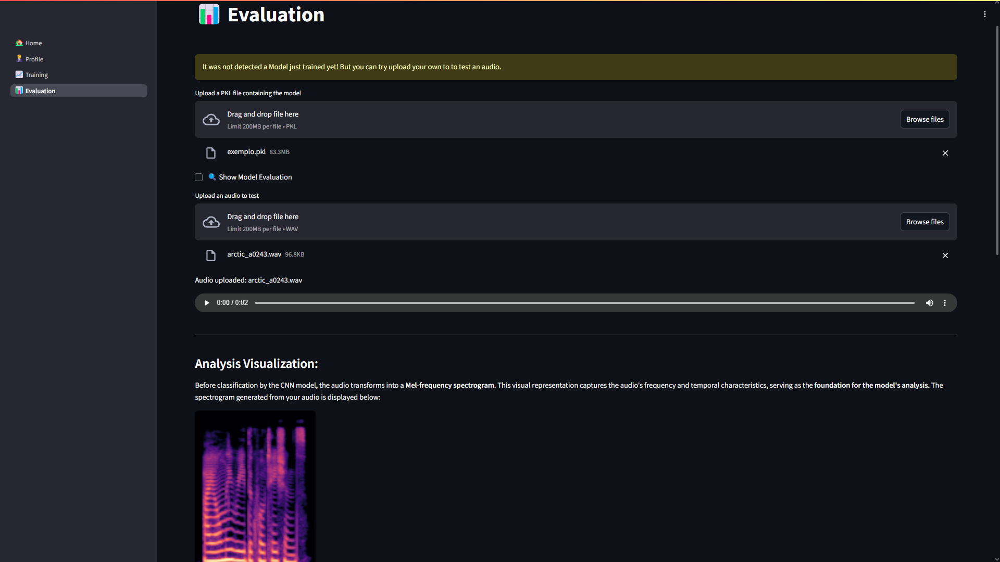

    
- **Evaluation Result**
Once the audio is processed and the model's inference is performed, the application displays the evaluation result clearly. Possible outcomes include:
    - **Audio Classified as Human:**
    When the model predicts that the audio is original (bonafide) and not synthesized, a positive visual indication is presented, confirming the original nature of the audio, example in Figure 16.

    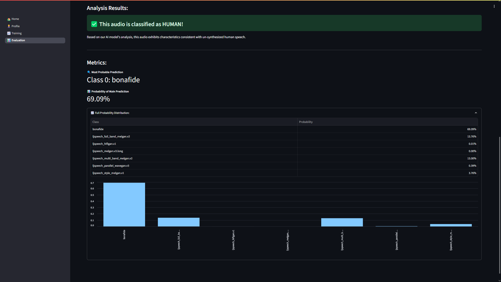

    - **Audio Classified as Machine-Generated:**
    If the model identifies the audio as synthesized, the application indicates the most probable **Vocoder** that generated it, or a similar category, based on learned patterns, example in Figure 17.

    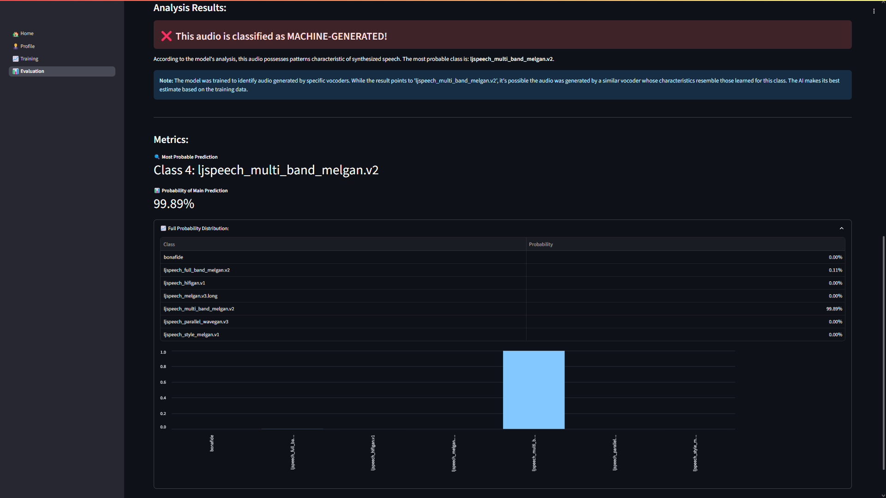

    - **Inconclusive Analysis:**
    If the model's confidence in its most probable prediction falls below a defined threshold (e.g., 60% was used as an example), the application signals that the analysis was inconclusive, example in Figure 18.

    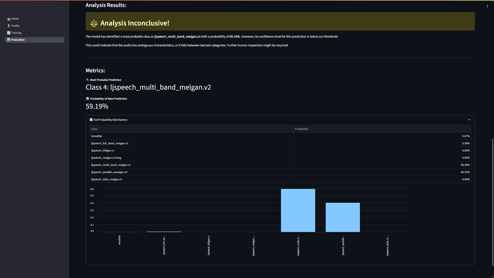
    
    This manual evaluation step allows the user to quickly validate the model's behavior on specific audio files. Based on this analysis, the user can decide to retrain the model, repeating the steps described in the Training Page section until satisfactory performance is achieved for their needs.

---

## ⚙️ Technical Details

- **Frameworks:** [Fastai](https://www.fast.ai/), [PyTorch](https://pytorch.org/), [Streamlit](https://streamlit.io/)
- **Audio Processing:** [Librosa](https://librosa.org/doc/latest/index.html)
- **Containerization:** [Docker](https://www.docker.com/)

---

## 💡 Future Enhancements

We envision several exciting improvements for this application:

- **Detailed Information Pages ("Learn More"):** Integrate dedicated sections for each neural network architecture and spectrogram transformation type. These pages would include detailed descriptions, diagrams, and direct links to original scientific articles, serving as a valuable educational resource, potentially incorporating translated theoretical background from this thesis.
- **Resource Optimization & Scalability:** Future work will explore integration with cloud computing services or container orchestration solutions like Kubernetes. These approaches will provide resource isolation, mitigate conflicts, and enable true large-scale, concurrent training and deployment.
- **Generalization & Pipeline Expansion:** Adapt the application to serve as a generic CNN training pipeline for diverse classification tasks (e.g., image, other audio types). More ambitious future steps could involve expanding to other deep learning paradigms like object detection (e.g., YOLO) or fine-tuning Large Language Models (LLMs).
- **Enhanced Analysis & Explainable AI:** Add more in-depth post-training analysis tools. The aim is to simplify prediction understanding for novice users via intuitive visualizations while retaining raw data and detailed metrics for expert analysis.

---

## 📄 License

MIT © Lucas ???
